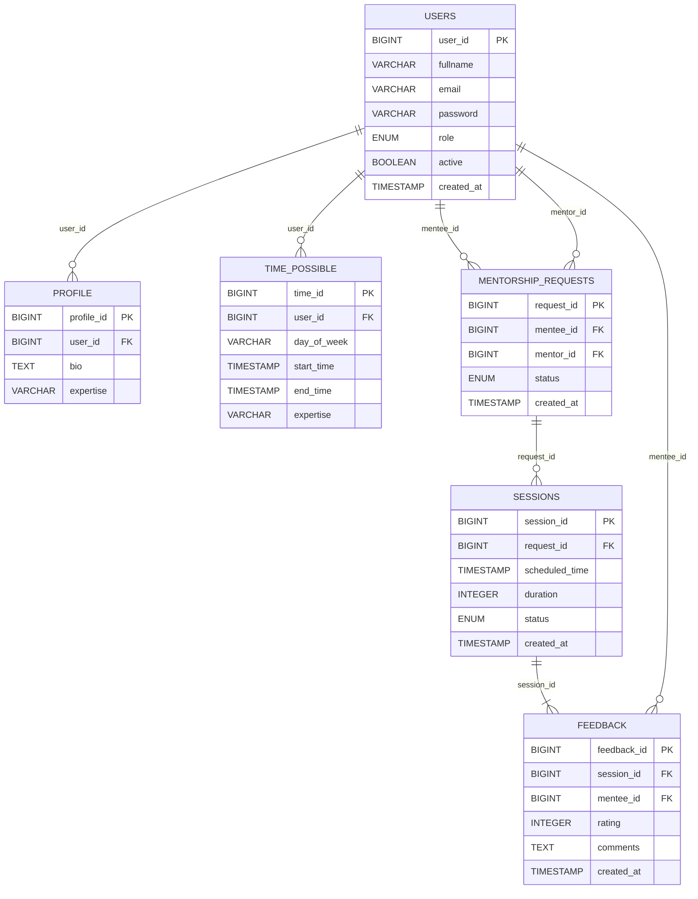

# <p align="center"> 👩‍🏫 MentorShip Tech</p>


## Subject 
- Create api to manage mentorship between mentor and mentee with date and time to register
- Validate hours that mentor has and if it is same hours available of mentee
- Connect, make networking and help each other with tips and doubt about career at IT
- Theme choice by me. Focus in deliever project using Spring Boot to platform DIO (course of java)

  ## Tecnologies:
- <b>JPA</b> : persistence database voluntario to make queries to find data and create registers about mentor, admin and mentee
- <b>Hibernate and JPQL</b> : create queries customized to find and return specif data
- <b>Spring boot</b> : deploy the project to website
- <b>Postgres</b>: make queries complex, easy to manipulation and mantain ACID

## Diagram 

## To do it: 
- [X] (Users)
- [X] Profile
- [X] Time possible
- [ ] Session
- [ ] Mentorship
- [ ] Feedback

## How use it:
- Execute file with name VoluntarioApplication
- Create database with name db_dio_voluntario
- O uri backend : ``` localhost:7080/ ``` + name of route
